# Ansible Pipeline 

## Ansible Setup

### 1. Configure Ansible
- Added `ansible.cfg` to handle passwords.
- Created `inventory.ini` to define the machines where services will be installed.
- Added `plugins.txt`, as it is required in `playbook.yml`.

### 2. Additional Installations
- Added **OpenJDK 17** to the **nginx** machine so that the Jenkins agent can run.
- Updated **Jenkins** and **SonarQube** to the latest versions.

### 3. Run the Playbook
Run the playbook using:

```bash
ansible-playbook -i inventory.ini playbook.yml
```

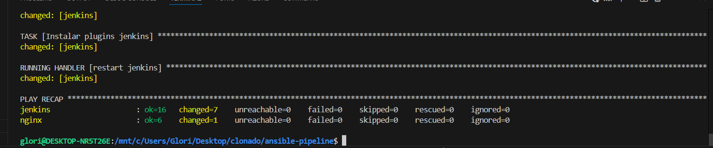

## Jenkins Configuration

   
   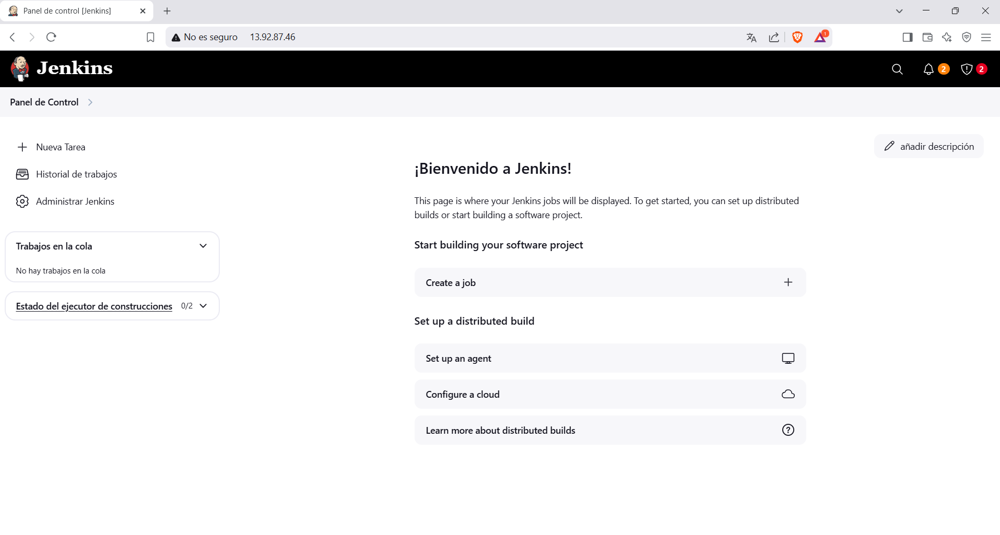

### Requirements
Before setting up Jenkins, install the following plugins:
- **SSH Build Agents**: To add the agent in Jenkins.
- **GitHub Plugin**: To clone and use the project repository.
   
   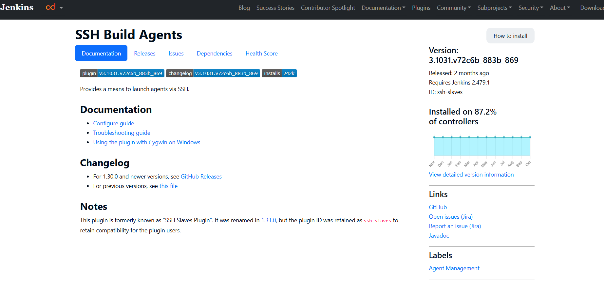
   
   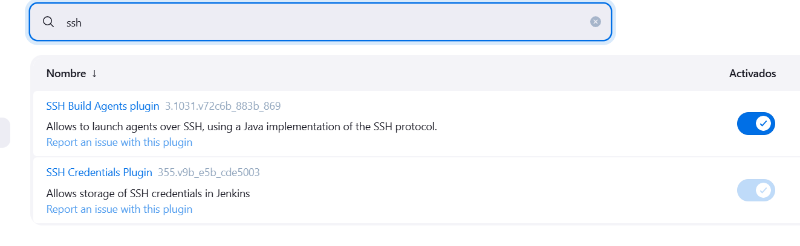
   
   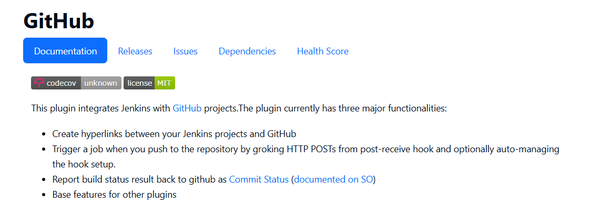
   
   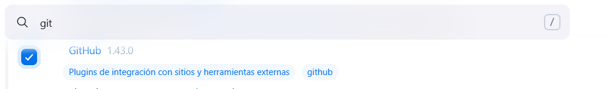
### Add Credentials to Jenkins
1. In Jenkins, go to **Manage Jenkins > Manage Credentials**.
2. Add new credentials using **username and password** (instead of RSA keys, which can be problematic).
3. It should look like this:
   
   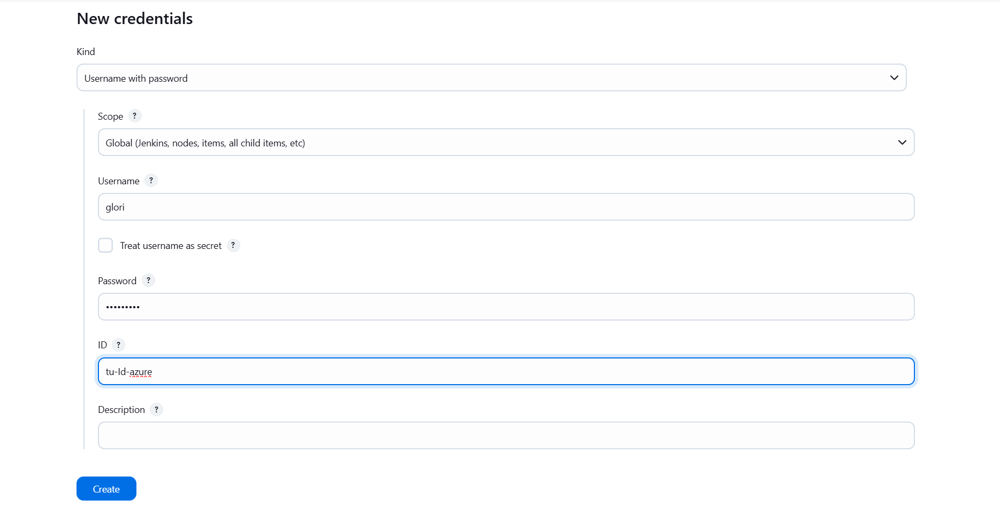


### Configure the Jenkins Agent
1. In Jenkins, go to **Manage Nodes and Clouds > New Node**.
2. Fill in the agent configuration, **making sure to add a label** to use later.
   
   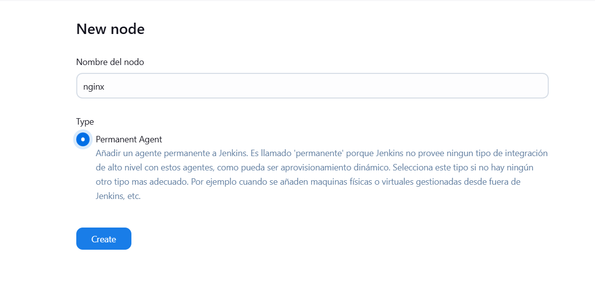
   
   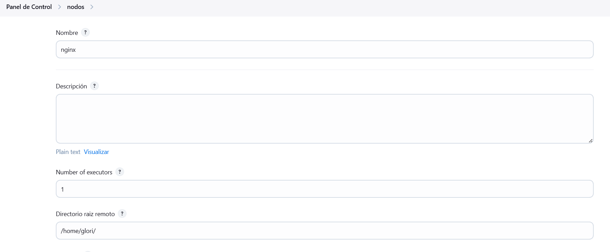   
    
   
3. In the SSH connection section, add the **IP address** of the machine where the agent will run.
   
   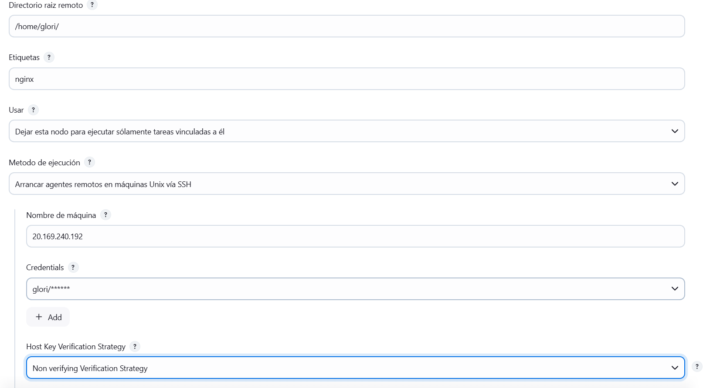
   
4. Save the configuration and **launch the agent**.
5. Ensure that Java is installed on the agent machine, as Jenkins requires it to run.
6. Verify that the agent is running correctly by checking the logs:
   
   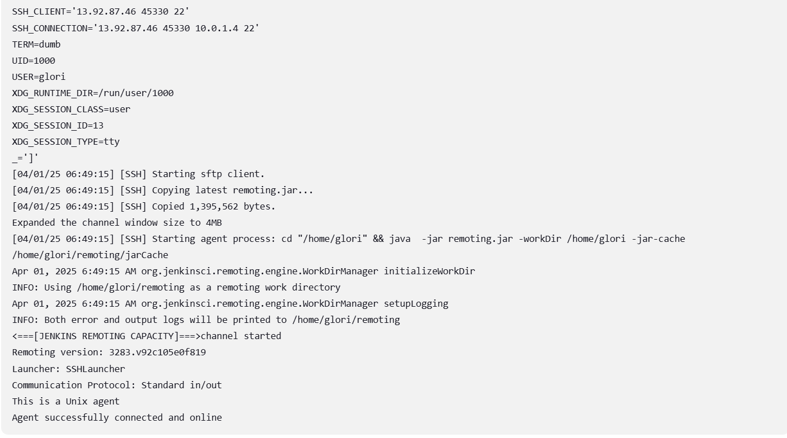

If you encounter issues, check the logs and make sure the SSH connection is working properly.

## Creating the Task (Job) in Jenkins

1. In Jenkins, create a new task and give it a name.
2. **Restrict task execution** to the node where the agent is located, using the same label assigned earlier.
   
   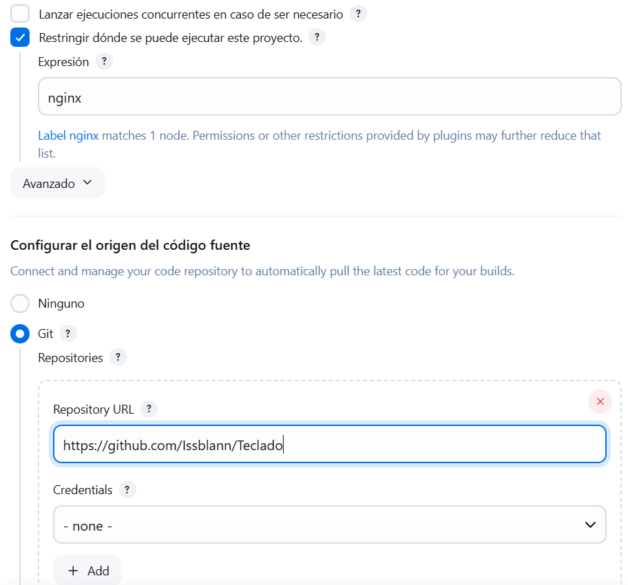

3. **Add the Git repository URL**, ensuring you are using the correct branch (`main` or `master`).

   
   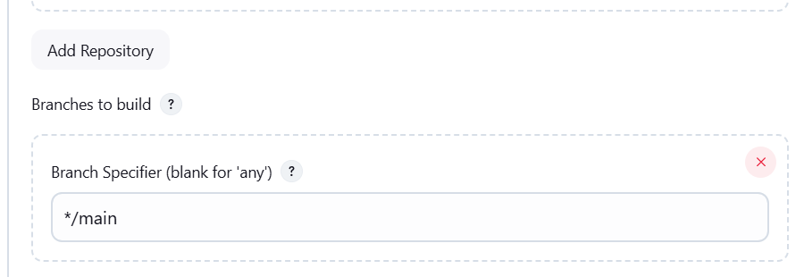
   
   
4. **Set up a Shell script** to move the files to the default nginx directory:
   
   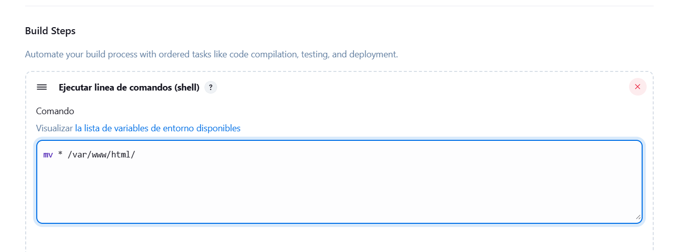
   

5. **Run the task and check the console output** to ensure everything is working correctly.
   
   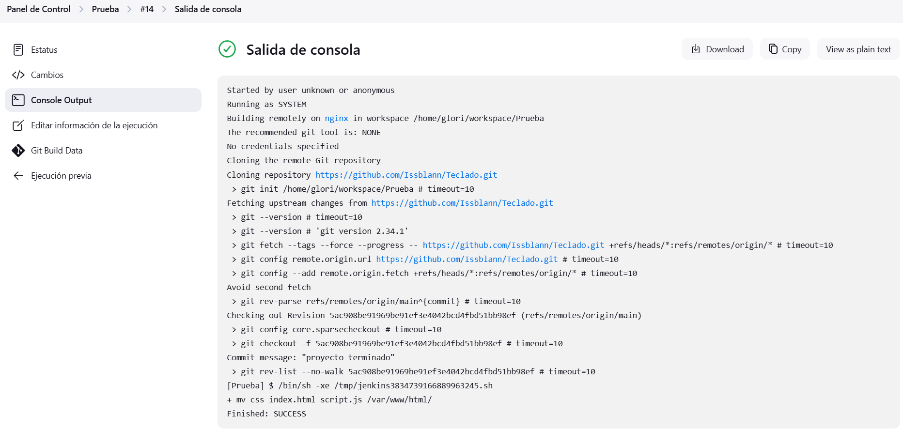
## Deployment Verification

1. Open a browser and go to `http://<SERVER_IP>:8080`.
2. If everything was set up correctly, you should see the app running:
   
   

